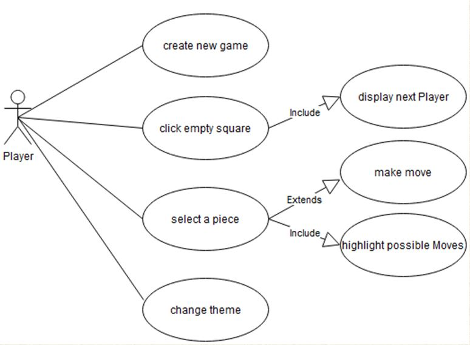
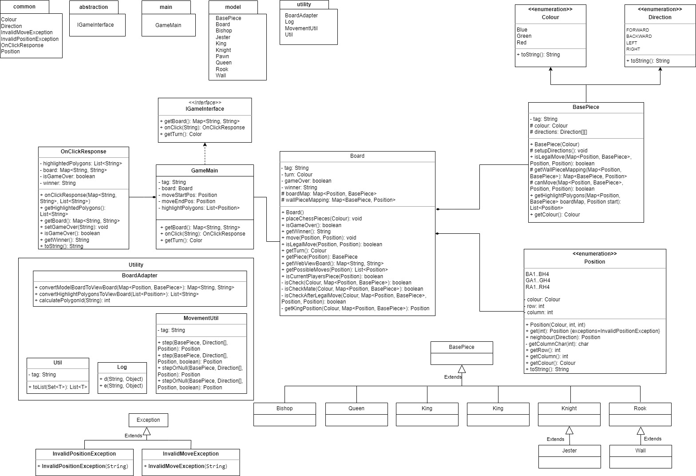
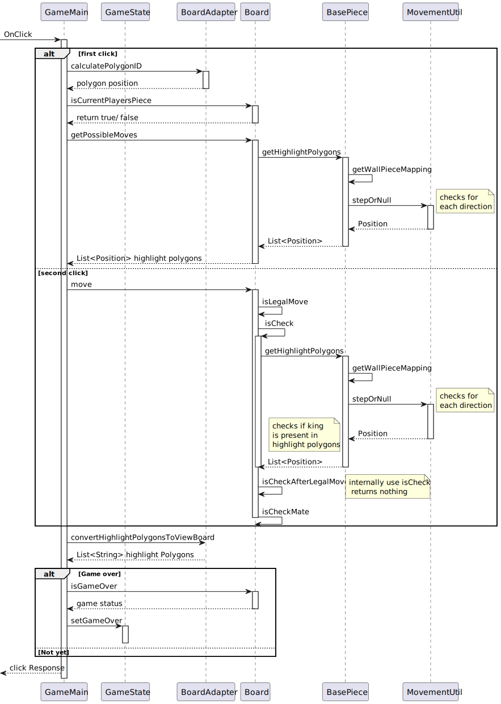
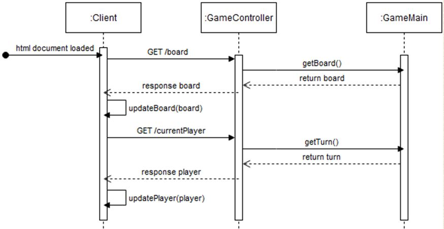

# Three Player Chess - Coding Ninjas
This document describes the architecture of the 3 player chess implementation by coding ninjas. 
Overall, this is a springboot application, of which the backend is a java application. And for the frontend 
graphical use interface, Javascript along with html and css is used. 

### Key Design Decisions
* The game is a springboot application
* Multi module gradle project comprising of backend and web app
* Web app is developed using html, css and javascript
* On a click input from the web app, backend sends all the required information
* A new piece "JESTER" - which moves similar to KNIGHT but swaps positions with the opponent
* A new piece "WALL" - moves similar to rook but can neither take opponent piece nor be taken down. 

For every action in the web application, a post request is made. 

### Use Case Diagram

### Backend Class Diagram

### Backend Sequence Diagram

### Client Server Communication

